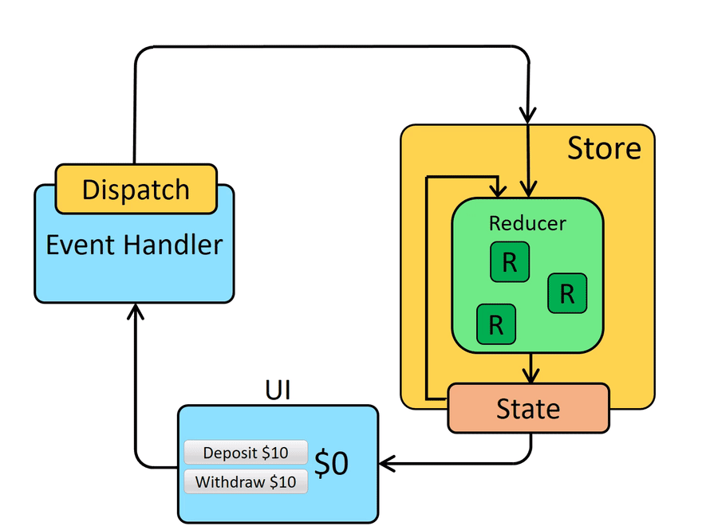

# [Redux](https://redux.js.org/)
 

## Reducer
```js
const reducer = (state = 0, action) => {
  switch (action.type) {
    case 'INC':
      return state + 1;
    default:
      return state;
  }
};

let state = reducer(undefined, { });

state = reducer(state, { type: 'INC' });
console.log(state); // 1

state = reducer(state, { type: 'INC' });
console.log(state); // 2
```
## Redux
```bash
> npm install redux
```
```js
import { createStore } from 'redux';

const reducer = (state = 0, action) => {
  switch (action.type) {
    case 'INC':
      return state + 1;
    default:
      return state;
  }
};

const store = createStore(reducer);

store.subscribe(() => {
  console.log(store.getState());
});

store.dispatch({ type: 'INC' });
store.dispatch({ type: 'INC' });
store.dispatch({ type: 'INC' });
```

### Example
```html
<!--index.html-->
<!DOCTYPE html>
<html lang="en">
  <head>
    <meta charset="utf-8" />
    <title>Redux App</title>
  </head>
  <body>
    <div id="root">
      <h1 id="counter">0</h1>
      <button id="dec">DEC</button>
      <button id="inc">INC</button>
      <button id="rnd">RND</button>
    </div>
    <script src="index.js"></script>
  </body>
</html>
```
```js
// index.js
import { createStore } from 'redux';

const reducer = (state = 0, action) => {
  switch (action.type) {
    case 'INC':
      return state + 1;
    case 'DEC':
      return state - 1;
    case 'RND':
      return state + action.value;
    default:
      return state;
  }
};

// action creators
const inc = () => ({ type: 'INC' });
const dec = () => ({ type: 'DEC' });
const rnd = (value) => ({ type: 'RND', value });

const store = createStore(reducer);

document.getElementById('inc')
  .addEventListener('click', () => {
    store.dispatch(inc());
  });

document.getElementById('dec')
  .addEventListener('click', () => {
    store.dispatch(dec());
  });

document.getElementById('rnd')
  .addEventListener('click', () => {
    const value = Math.floor(Math.random() * 10);
    store.dispatch(rnd(value));
  });

const updateCounter = () => {
  document.getElementById('counter')
    .textContent = store.getState();
};

store.subscribe(updateCounter);
```

## React
```bash
> npm install redux react-redux
```
### Example
```html
<!--index.html-->
<!DOCTYPE html>
<html lang="en">
  <head>
    <meta charset="utf-8" />
    <title>Redux App</title>
  </head>
  <body>
    <div id="root"></div>
  </body>
</html>
```
```js
//index.js
import React from 'react';
import ReactDOM from 'react-dom';
import { Provider } from 'react-redux';
import { createStore } from 'redux';
import reducer from './reducer';
import App from './components/app';

const store = createStore(reducer);

ReactDOM.render(
  <Provider store={ store }>
    <App/>
  </Provider>,
  document.getElementById('root')
);

```
```js
// actions.js
// action creators
export const inc = () => ({ type: 'INC' });
export const dec = () => ({ type: 'DEC' });
export const rnd = (value) => {
  return { type: 'RND', value: Math.floor((Math.random() * 10) + 1) };
};
```
```js
// reducer.js
const reducer = (state = 0, action) => {
  switch (action.type) {
    case 'INC':
      return state + 1;
    case 'DEC':
      return state - 1;
    case 'RND':
      return state + action.value;
    default:
      return state;
  }
};

export default reducer;
```
```js
// app.js
import React from 'react';
import Counter from './counter';

const App = () => {
  return (
    <div className="app">
      <Counter/>
    </div>
  )
}

export default App;
```
```js
// counter.js
import React from 'react';
import { connect } from 'react-redux';
import * as actions from '../actions';

const Counter = ({ counter, inc, dec, rnd }) => {
  return (
    <div className="counter">
      <h1>{ counter }</h1>
      <button onClick={ dec }>DEC</button>
      <button onClick={ inc }>INC</button>
      <button onClick={ rnd }>RND</button>
    </div>
  );
};

const mapStateToProps = (state) => {
  return {
    counter: state
  };
};

export default connect(mapStateToProps, actions)(Counter);
```


